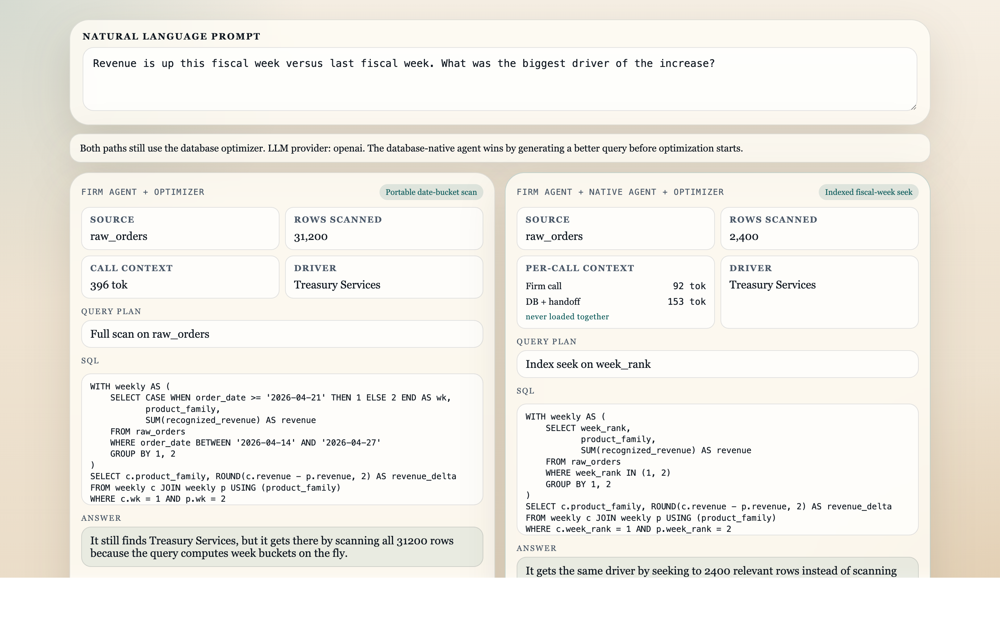

# The Right Agent for the Right Job

**A working demo of multi-agent context engineering: how to split a system into a domain-owned agent and a vendor-owned agent, with a small structured handoff in between.**

As of Apr 2026, the field has largely moved past the question of whether to use multiple agents. The harder question is how to divide responsibility so each agent carries the narrowest working context that still produces a correct result, and I believe that one remains unsettled. This repo is a runnable attempt at one answer. The specific mechanics will likely not age well as tooling matures, but the underlying problem of ownership boundaries in multi-agent systems is not going away.

The scenario is specific: a bank ("ExaBank") needs portable business logic, but also needs queries that exploit the physical layout of whatever database vendor it happens to run on. I don't think one agent should try to own both. The demo shows what happens when it does, and what changes when responsibility is split with a typed handoff.

If you have two minutes, jump to [Result](#result) and [Context split](#context-split). If you want to read the agent code, start at [`agents/firm_agent.py`](agents/firm_agent.py) and [`agents/database_native_agent.py`](agents/database_native_agent.py). The LLM client in [`agents/llm.py`](agents/llm.py) is stdlib-only `urllib` with no SDK dependencies, so you can read the full request/response path in one sitting.

---

## The Setup

Here, the `firm agent` is ExaBank's. It handles business meaning, fiscal logic, policy, and the user-facing behavior that the bank wants to keep portable. The `database-native agent` is provided by the database vendor and rewrites that approved request for the engine that is actually running underneath.

A strong LLM can already get natural-language-to-SQL mostly right. Keeping the firm agent portable while still using engine-specific query knowledge when it matters is the part that needs structure.



## The Demo

> Revenue is up this fiscal week versus last fiscal week. What was the biggest driver of the increase?

The comparison is controlled. Both paths use:

- the same business question
- the same natural-language-to-SQL capability
- the same approved metric
- the same `raw_orders` table
- the same database optimizer
- the same final answer

The only thing that changes is the SQL handed to the optimizer. One query is written in a portable way; the other is rewritten with knowledge of the engine's physical layout.

`ExaBank firm agent + DB optimizer`
- understands the business question
- writes portable SQL the bank can carry across providers
- computes week buckets from dates
- pushes the engine into a full scan

`ExaBank firm agent + database-native agent + DB optimizer`
- uses the same business meaning
- keeps the firm agent's business logic portable
- adds a database-vendor-provided engine-aware query rewrite at execution time
- preserves the physical `week_rank` key
- gives the optimizer an access path it can use

## Result

On the seeded data:

- both paths identify `Treasury Services` as the driver
- the firm-agent-only path scans `31200` rows
- the database-native path seeks to `2400` relevant rows
- peak context drops from `396` tokens to `183` tokens

Both paths reach the same answer. The split path gets there with a better query and a smaller peak working context.

## Context split

The optimizer is doing its job in both paths. It cannot rescue a query that was written in the wrong shape to begin with. That is the gap the native agent fills. The firm agent should stay focused on ExaBank's logic: what revenue means, how fiscal weeks are defined, what counts as a driver, and what the user is allowed to see. The vendor's native agent can then express that request in a way that fits the active engine, without baking engine-specific assumptions back into the bank's main agent.

If one agent is asked to carry business definitions, fiscal rules, access constraints, schema details, and engine guidance all at once, the prompt gets large quickly.

A single firm agent has to hold:

- revenue definitions
- fiscal calendar rules
- approved driver logic
- security and policy constraints
- database metadata
- engine-specific optimization guidance

In the split design:

- the ExaBank firm agent carries the internal glossary, compliance rules, approved metric definitions, and role-based restrictions
- the database-vendor-provided native agent carries schema metadata, query patterns, dialect expertise, and engine-specific optimization knowledge
- the handoff is a small structured spec

That does not mean a two-agent flow always uses fewer total tokens. It means each step carries a narrower working set. Additionally, in production this matters because large mixed prompts make it easier for the model to miss the few details that actually matter for the step in front of it.

## Repo Structure

The demo has actual agent modules:

- `agents/firm_agent.py`
- `agents/database_native_agent.py`
- `agents/llm.py`

The server in `server.py` is only the orchestrator.

## Setup

Requirements:

- Python 3.11+
- one LLM API key

Supported environment variables:

- `OPENAI_API_KEY`
- `CLAUDE_API_KEY`
- `GEMINI_API_KEY`

Optional overrides:

- `DEMO_LLM_PROVIDER`
- `OPENAI_MODEL`
- `CLAUDE_MODEL`
- `GEMINI_MODEL`

Provider selection works like this:

1. if `DEMO_LLM_PROVIDER` is set, that provider is used
2. otherwise the demo prefers `OPENAI_API_KEY`, then `CLAUDE_API_KEY`, then `GEMINI_API_KEY`

If no API key is present, the demo falls back to deterministic built-in SQL so the UI still runs.

## Run

```bash
export OPENAI_API_KEY=...
python3 server.py
```

Then open [http://127.0.0.1:8000](http://127.0.0.1:8000).

## What Runs

`ExaBank firm agent + DB optimizer`
- one live LLM call in `ExaBankFirmAgent.build_portable_sql(...)`

`ExaBank firm agent + database-native agent + DB optimizer`
- one live LLM call in `ExaBankFirmAgent.build_request(...)`
- one live LLM call in `DatabaseNativeAgent.build_engine_sql(...)`

The status line in the UI shows which provider is active.

## Files

- `server.py`
- `agents/firm_agent.py`
- `agents/database_native_agent.py`
- `agents/llm.py`
- `static/index.html`
- `static/styles.css`
- `static/app.js`
- `docs/demo-screenshot.png`

---

## About

Built by [Nandu Jayakumar](https://www.linkedin.com/in/junkumar/), with 20+ years in distributed data systems at Meta, Oracle, Visa, and Yahoo. This is one of a few small runnable demos I've built in Apr 2026 while thinking through agent architecture patterns that I believe are important right now.
